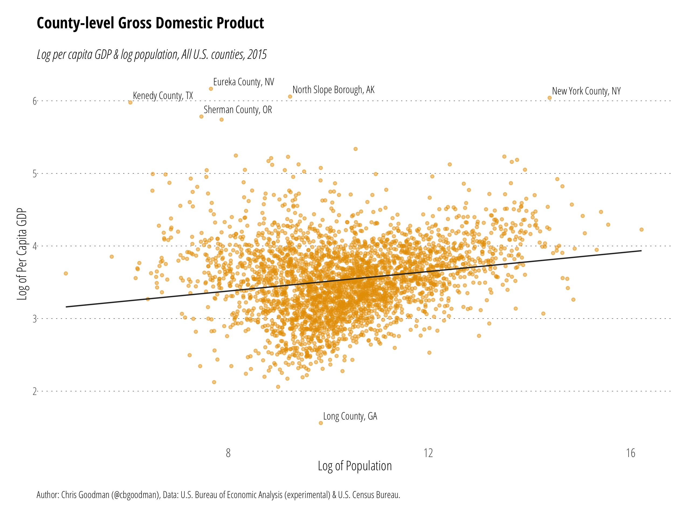
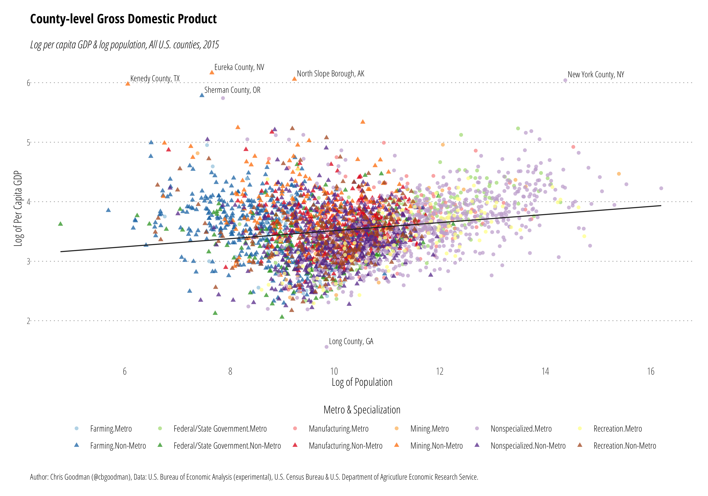
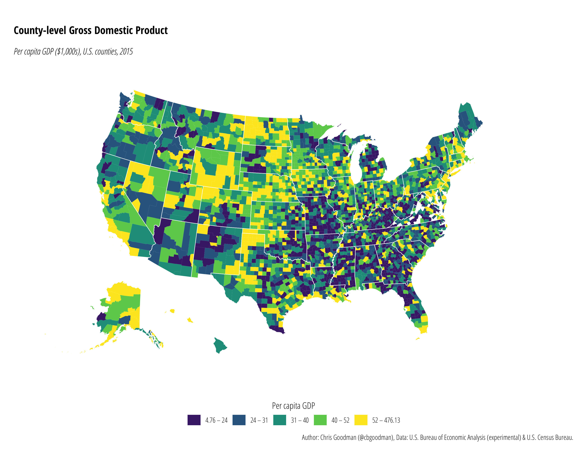

# County-Level Gross Domestic Product
The **R** script `county-gdp-simple.r` reads `bea_county_gdp.csv` to create the first image below of log per capita GDP and log population. County-level GDP data is from the [U.S. Bureau of Economic Analysis](https://www.bea.gov/data/gdp/gdp-county) and county population estimation are from [U.S. Census Bureau](https://www.census.gov/programs-surveys/popest.html).

